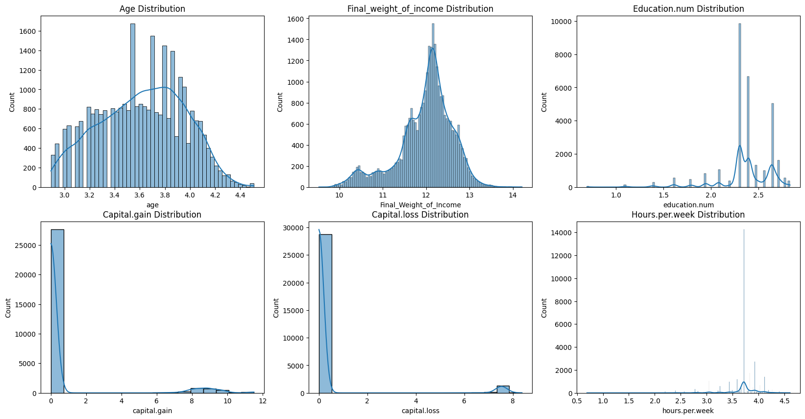
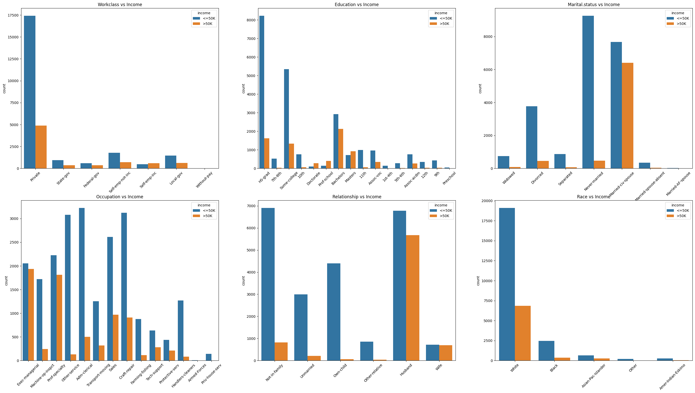
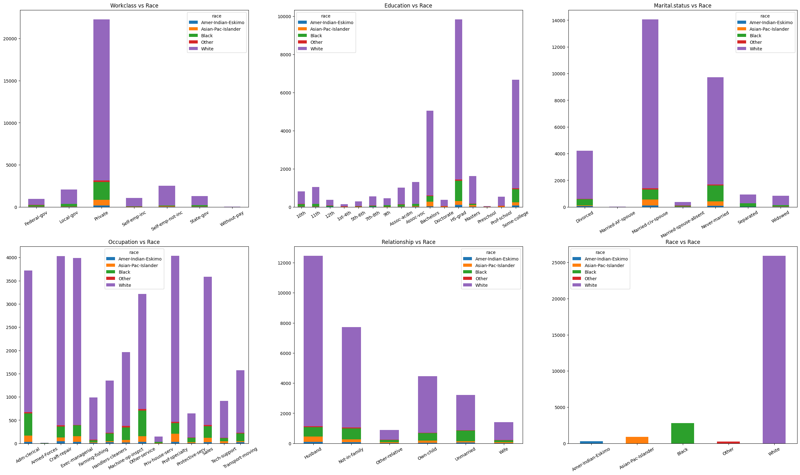
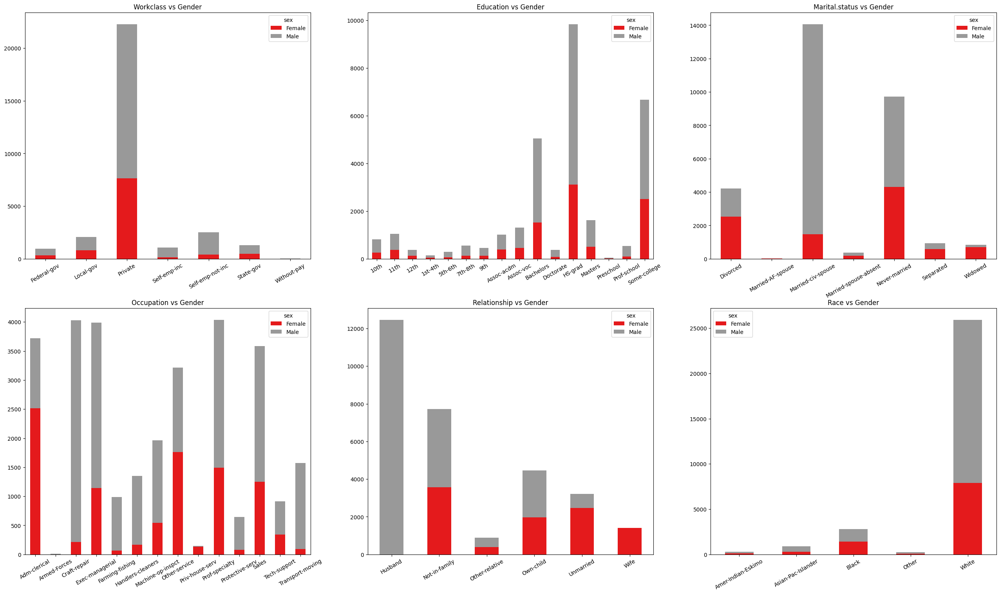
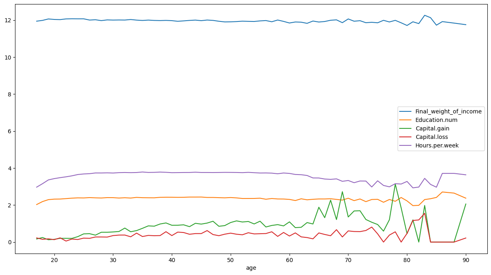
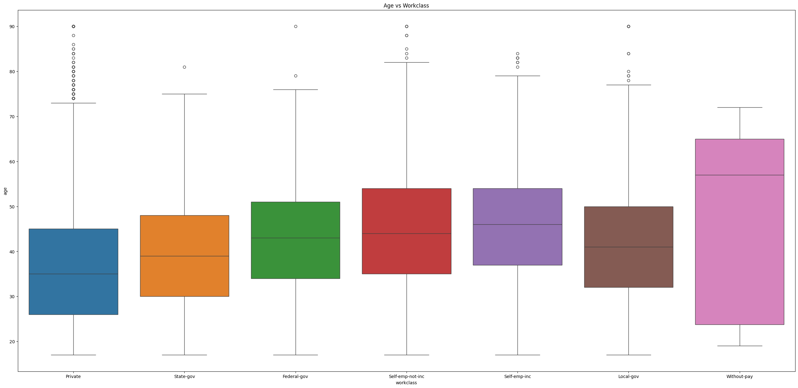
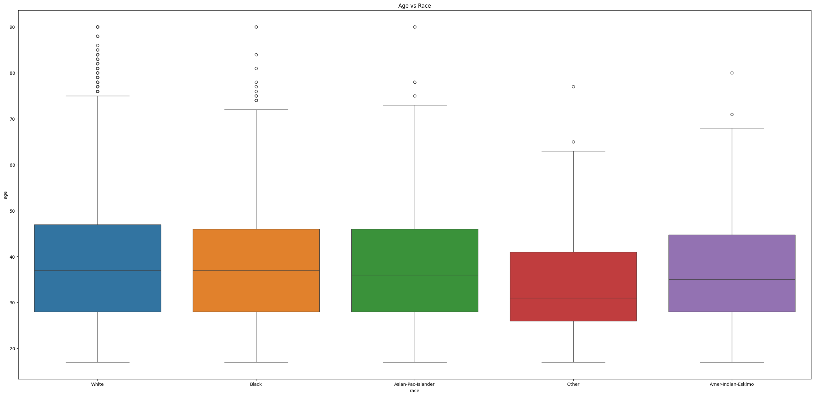
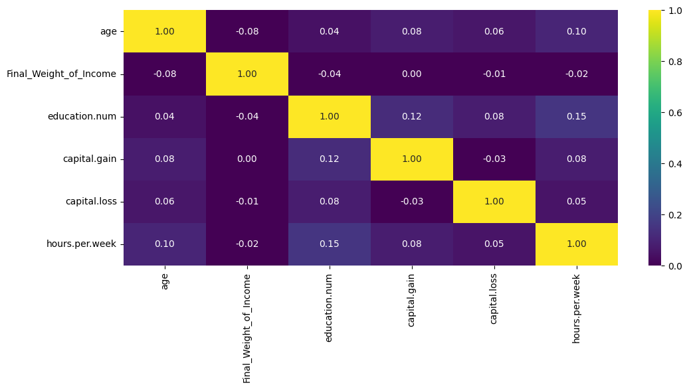
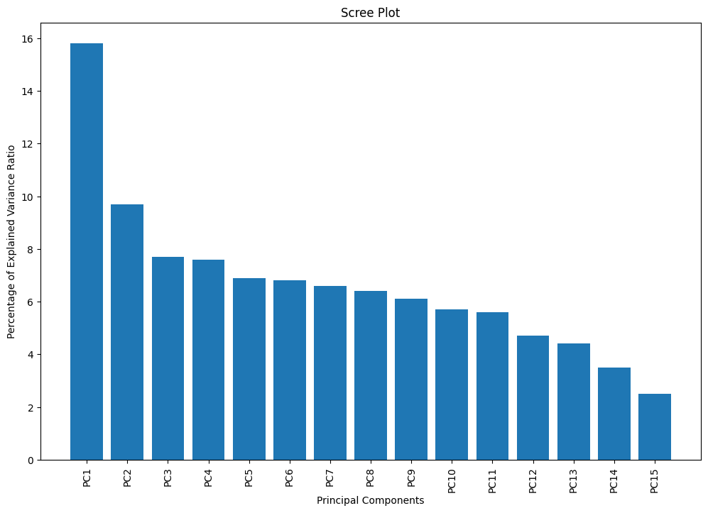

# Adult Income Datasets 

This dataset comprises adult income data from the United States, including information on various races, age groups, gender identities, and other features.

In this analysis, data processing, visualization, principal component analysis, and a logistic regression model were primarily performed.

This dataset provides valuable insights into how income is distributed across different demographics in the United States.

## Variable Distribution

## Income Distribution

## Race Distribution

## Gender Distribution

## Wealth Indicator Analysis by Age

## Workclass vs Age Analysis

## Correlation Matrix

## PCA Analysis

